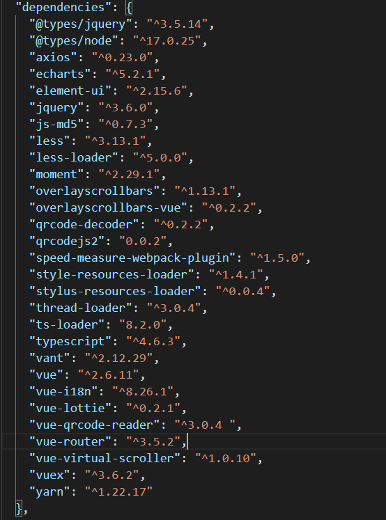
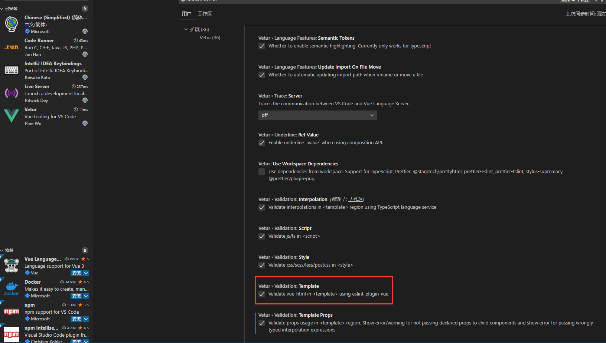

### 记一次 vue2 添加typescript支持的经验

前提：本项目因时间原因没有使用`vue-property-derocator`去做重构，仅仅只是在原项目的基础上进行了ts语法、文件支持，默认已安装vuecli和typescript

那么现在开始

---

1、首先安装typescript，本文使用的是yarn

```javascript
yarn add typescript ts-loader -S
```

项目启动时如果报错 `loaderContext.getOptions is not a function` 则是ts-loader 的版本过高导致，可以考虑降低版本，本文环境环境如下



2、接下来需要在根目录创建tsconfig.json 文件，与src目录平级，告诉ts应该做一下什么事。也可以通过执行

`tsc --init`命令生成

```javascript
{
    "compilerOptions": {        
        // 目标语言的版本
        "target": "esnext",
        // 生成代码的模板标准
        "module": "esnext",
        // 模块解析策略，ts默认用node的解析策略，即相对的方式导入
        "moduleResolution": "node",
        // 允许export=导出，由import from 导入
        "esModuleInterop": true,
        // 允许编译器编译JS，JSX文件
        "allowJs": true,
        // 生成目标文件的sourceMap文件
        "sourceMap": true,
        // 开启所有严格的类型检查
        "strict": true,
        // 不输出文件,即编译后不会生成任何js文件
        "noEmit": false,
        // 检查只声明、未使用的局部变量(只提示不报错)
        "noUnusedLocals": true,
        // 跳过所有的类型检查 .d.ts 文件
        "skipLibCheck": true,
        // 不允许隐式的any类型
        "noImplicitAny": true,
        // 允许导入json文件
        "resolveJsonModule": true,
        // 用于防止编辑器报错 无法写入文件 ****.js,因为它会覆盖输入文件
        "baseUrl": "./", 
        "outDir": "./outDir",
        // 当模块没有默认导出时，允许“从y导入x”。
        "allowSyntheticDefaultImports": true,
    },
    "exclude": [
        "dist",
        "types",
		"babel.config.js",
		"public",
        "public/js/config.js"
    ]
}
```

3、vue.config.js 改造

```javascript
// 添加以下代码
configureWebpack:{
	module:{
		rules:[
			{
				test: /\.tsx?$/,
				loader: 'ts-loader',
				exclude: /node_modules/,
				options: {
				  appendTsSuffixTo: [/\.vue$/],
				}
			}
		]
	},
    resolve:{
    	extensions: [".ts", ".tsx", ".js", ".json"]
    },
}
```

到此处的时候项目已经能够识别导入的ts文件了，但是仍然无法静态检查。需要静态识别则需要对vue文件中的

script 标签加上lang='ts' 属性。但是新一轮的问题又来了，加了这个属性之后项目整个都会报错。此时可以在该文件主动引入Vue,再通过export default Vue.extend( { 原来的代码 } )解决报错.

```
import Vue from 'vue'
export default Vue.extend({
	data(){
		
	}
});
```

---

额外补充：使用vue.extend的方式时，组件的props校验需要使用额外的方式

```javascript
import Vue,{ PropType } from "vue";
interface arr {
	id:number,
	value:string
}
export default Vue.extend({
	props:{
		arrList:{
			required:true,
			type:Array as PropType<arr[]>
		}
	}
})
```

如果编辑器对组件接收了错误的参数没有报错提示，可以查看编辑器配置，以vscode + vetur 举例



另外注意项目中的.vscode 文件夹中 setting.json 的配置

```json
{
    "vetur.validation.interpolation": true
}
```


---


4、额外补充 在vue2中使用 ?. 和 ?? 语法

- 安装babel 的plugin-proposal-optional-chaining

  ```javascript
  yarn add @babel/plugin-proposal-optional-chaining -S
  ```

- 创建或修改babel.config.js

  ```
  module.exports = {
      // 在plugins下添加如下代码
      plugins: [
          ["@babel/plugin-proposal-optional-chaining"]  //解析 可选链式语法
      ]
  }
  ```

- vue.config.js 中配置chainWebpack

	```
  chainWebpack:config=>{
  		config.module
			.use('babel-loader')
			.loader('babel-loader')
			.end()
  }
	```

  
